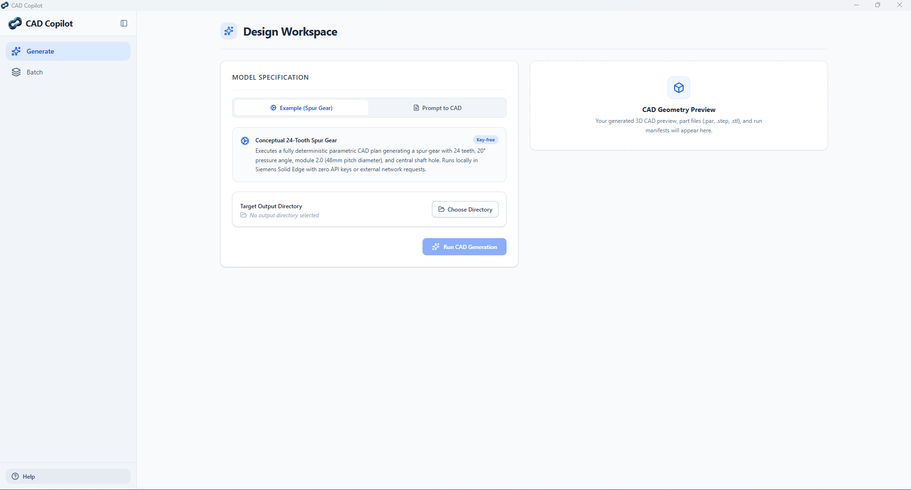
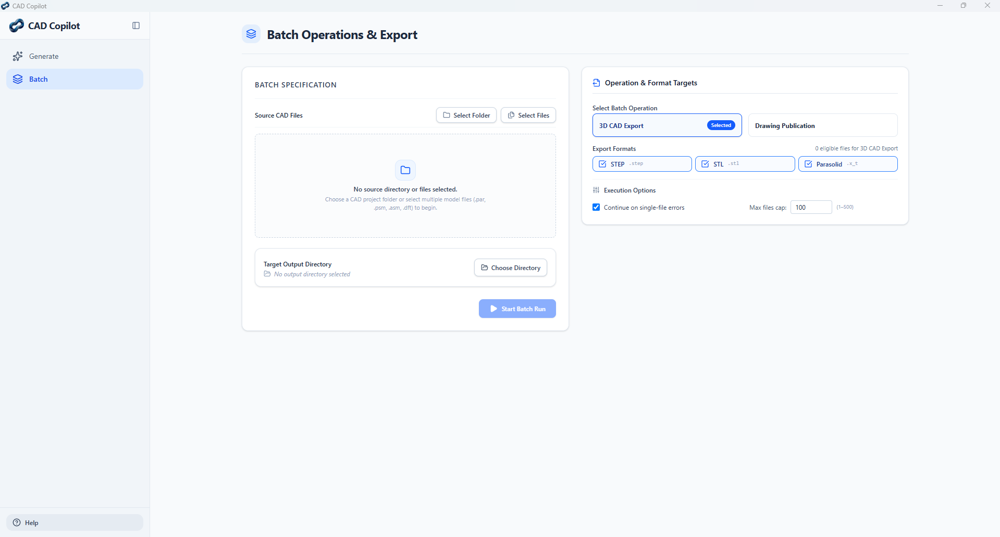
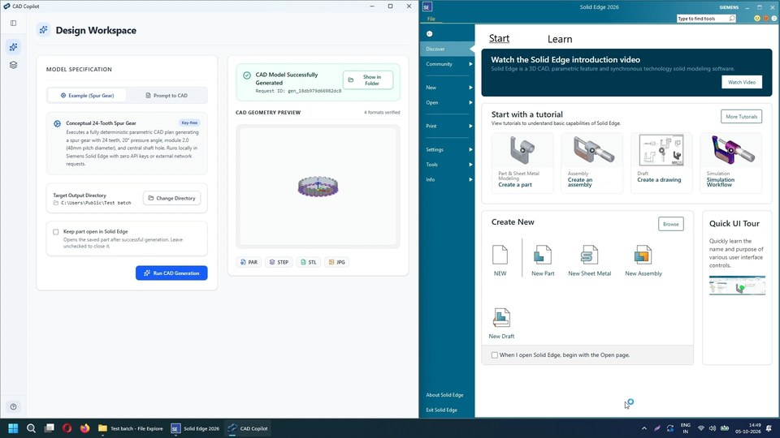
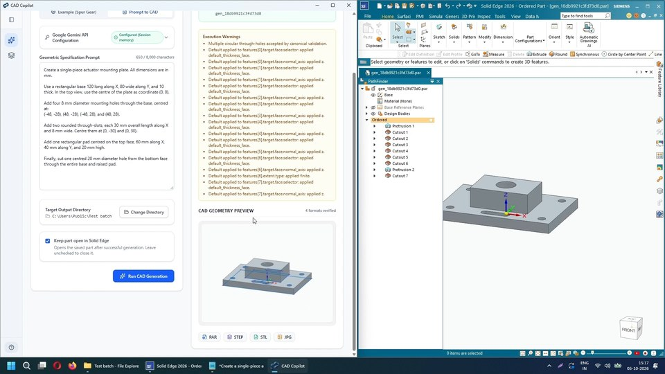
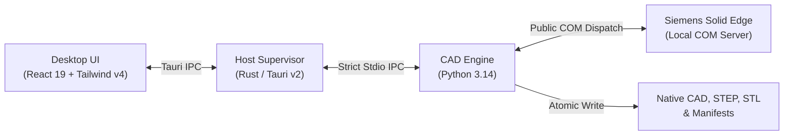

# CAD Copilot — Windows Preview

> **Local AI-assisted Solid Edge® generation and native batch export.**

CAD Copilot is an open-source Windows desktop application that converts natural-language design intent into validated Siemens Solid Edge® parts and automates safe, multi-format local batch exports.

---

## Verified Core Capabilities

- **Native Solid Edge Part Generation:** Constructs genuine 3D solid geometry in Solid Edge Ordered mode (rectangular blocks, cylinders, through/blind circular holes, rectangular and slot cutouts, planar pads, and conceptual spur gears).
- **Multi-Format Artifact Pipeline:** Automatically exports native `.par`, STEP, and STL models with a best-effort preview image and publishes a cryptographically verified `run_manifest.json` sidecar.
- **Automated Batch Translation & Publishing:** Processes native `.par`, `.psm`, and `.asm` files to STEP and STL, plus Parasolid (`.x_t`) when verification supports it, and publishes `.dft` drawings to PDF and DXF. Source files are closed without saving and checked for content changes.
- **Local-First Privacy & Optional AI:** CAD processing and output files stay local, with no telemetry. Optional Gemini prompt generation sends the text request to Google using a session-supplied API key. Deterministic examples and batch translation need no key or network connection.
- **Process Lifecycle & Safety:** A dedicated Solid Edge COM worker, targeted cancellation, bounded execution, and atomic output publication protect failed and cancelled runs.

---

## Try the App

**[Download the Windows x64 installer](https://github.com/jitendra-patwari/cad-copilot/releases/download/v0.1.0/CAD-Copilot_0.1.0_x64-setup.exe)** · **[Release notes and checksums](https://github.com/jitendra-patwari/cad-copilot/releases/tag/v0.1.0)**

Install CAD Copilot on Windows 10/11 (64-bit) with a local installation of Siemens Solid Edge®. The installer includes the engine and its dependencies; Python, Node.js, and Rust are only needed for development. Follow the **[Getting Started Guide](docs/getting-started.md)** for installation, checksum verification, a first key-free example, and optional source setup. Siemens offers **[Solid Edge Community Edition](docs/solid-edge-community-edition.md)** free of charge for personal, non-commercial use; separate qualification of every export format on that edition remains open.

For natural-language generation, follow **[Gemini API Key Setup](docs/gemini-api-key.md)** to obtain a key in Google AI Studio and run a first prompt using an eligible free-tier project. The guide covers session key entry, quotas, and free-tier data handling. Examples and batch exports need no API key.

## Watch the Demos

Click a preview to open the recorded MP4 demo.

| Key-free gear example (19 seconds) | Prompt to actuator mounting plate (65 seconds) |
| :--- | :--- |
|  |  |

The gear demo runs locally without an API key. The prompt demo shows a multi-feature part, its exported preview, and the keep-open option.

---

## Architecture at a Glance

CAD Copilot uses a decoupled desktop architecture with strict IPC boundaries:

```mermaid
flowchart LR
    UI["Desktop UI\n(React 19 + Tailwind v4)"] <-->|"Tauri IPC"| Rust["Host Supervisor\n(Rust / Tauri v2)"]
    Rust <-->|"Strict Stdio IPC"| Engine["CAD Engine\n(Python 3.14)"]
    Engine <-->|"Public COM Dispatch"| SE["Siemens Solid Edge\n(Local COM Server)"]
    Engine -->|"Atomic Write"| Artifacts["Native CAD, STEP, STL\n& Manifests"]
```

- **Frontend:** Responsive React 19 interface with real-time progress streaming over Tauri window events.
- **Process Supervisor:** Rust host managing engine child processes with fail-closed cancellation and job objects.
- **Engine Core:** Deterministic Python 3.14 pipeline separating pure geometric lowering from vendor COM automation.
- **Solid Edge Driver:** Single STA execution context with message filtering, bounded busy retries, and document handle tracking.

For an in-depth breakdown of components and security boundaries, see **[System Architecture](docs/architecture.md)**.

---

## Verification & Testing Boundaries

CAD Copilot maintains strict separation between automated portable gates and live CAD acceptance:

| Layer | Scope & Test Count | Verification Boundary |
| :--- | :--- | :--- |
| **Python Engine** | 2,473 passed, 4 skipped, 56 deselected | Gemini-fix source candidate: offline pytest, strict MyPy, Ruff linter & formatter |
| **Desktop Frontend** | 98 passed across 8 test files | Vitest suites, TypeScript typecheck, ESLint, Prettier, production Vite build |
| **Rust Desktop Host** | 131 passed, 8 ignored | Default Cargo test suite |
| **Live Source-App Checks** | Three repeated pad-and-through-hole runs inspected | Saved Solid Edge parts and canonical manifests on a licensed workstation |
| **Packaged Engine** | 6 offline lifecycle tests passed | Installer build from `491f536`, tested outside the checkout without developer tools |
| **Hosted CI Pipeline** | [3 jobs passed for the packaged source](https://github.com/jitendra-patwari/cad-copilot/actions/runs/36996167591) | Portable Python, frontend, and Rust checks |

*Full-suite counts above are dated historical records; the packaged build also has the focused follow-up checks documented in **[Verification Evidence](docs/verification.md)**. The user confirmed installed-app acceptance for the updated build on 5 October 2026; this was not independently rerun by the reviewer. Hosted CI does not run live Solid Edge COM automation.*

---

## Honest Boundaries & Limitations

- **Solid Edge Prerequisite:** CAD Copilot does not include a proprietary CAD kernel. Live part generation and batch translation require a licensed installation of Siemens Solid Edge on Windows.
- **Conceptual Gear Design:** The conceptual spur gear generator produces an illustrative parametric outline for visualization and modeling workflows, not a certified manufacturing-grade or load-bearing gear.
- **Prompt Interpretation Preview:** Some multi-feature prompts may be rejected or need rewording. Check the saved part and `run_manifest.json` against the requested dimensions, features, and faces before using a generated model.
- **Deterministic AI Guardrails:** The optional Gemini adapter proposes structured JSON feature plans; all geometric validation, dimension checks, and CAD lowering are executed by deterministic code before contacting Solid Edge.

---

## Trademark & Non-Affiliation Notice

- **Siemens® & Solid Edge®:** Siemens and Solid Edge are trademarks or registered trademarks of Siemens Product Lifecycle Management Software Inc. or its subsidiaries in the United States and other countries. CAD Copilot is an independent open-source project and is not affiliated with, endorsed by, sponsored by, or supported by Siemens. CAD Copilot interacts with Solid Edge solely through its standard, publicly documented Windows COM automation interfaces.
- **Microsoft® & Copilot:** Microsoft and Copilot are trademarks of Microsoft Corporation. CAD Copilot is an independent open-source tool and is not affiliated with, endorsed by, sponsored by, or associated with Microsoft Corporation or GitHub, Inc.

---

## License

CAD Copilot is licensed under the [MIT License](LICENSE).
