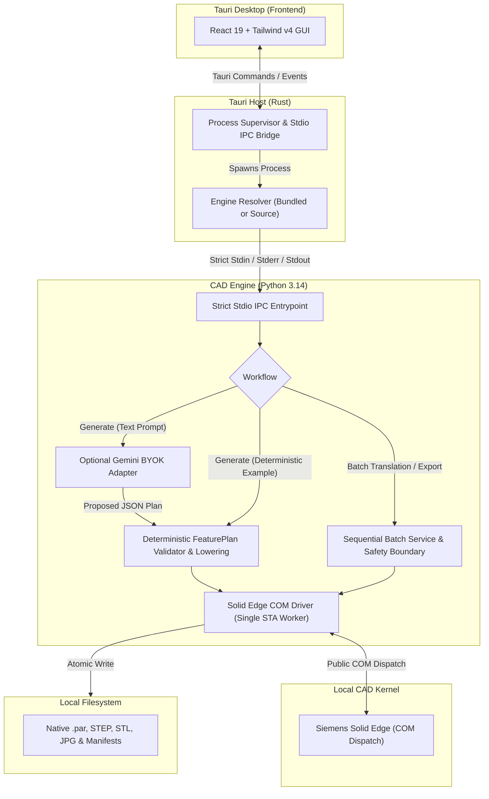

# System Architecture

CAD Copilot runs CAD operations locally and sends no telemetry. Optional Gemini prompt generation sends the text request to Google's API using a user-supplied key. The desktop application communicates with the CAD engine through stdio, and Solid Edge performs the modeling on the same Windows workstation.

---

## 1. High-Level System Flow

---

## 2. Component Boundaries & Responsibilities

### Desktop Frontend (React 19, TypeScript, Tailwind CSS v4)
- Provides focused **Generate** and **Batch** workspaces.
- Handles user inputs, file/directory selections, and parameter customization.
- Enforces strict input validation and path containment before invoking desktop commands.
- Holds optional Gemini API keys in session memory only (never written to disk).

### Desktop Host (Tauri v2, Rust)
- Manages the lifecycle of the Python engine process using dedicated job objects and process groups.
- Resolves the engine executable via compile-time configuration: the packaged release binary (`--features packaged-engine`) launches the bundled standalone engine executable, while development builds resolve the local virtual environment.
- Streams real-time progress events from engine `stderr` to the UI via Tauri window events.
- Enforces bounded pipes, cancellation via targeted `CTRL_BREAK_EVENT`, and fail-closed process cleanup.

### Python Engine Core (Python 3.14.3)
- **Strict Stdio IPC (`engine/src/ipc/`):** Bounded single-request stdin, progress events over stderr (JSONL), and single-response stdout. Early descriptor isolation prevents stdout contamination.
- **Pure Geometry & Lowering (`engine/src/geometry/`):** Coordinate mapping, profile validation, and deterministic feature plan lowering. Completely free of COM, I/O, or network dependencies.
- **AI Plan Adapter (`engine/src/plan_providers/`):** Treats Gemini's proposed JSON as untrusted input and validates it before CAD execution. Never invokes CAD APIs.
- **Batch Safety Boundary (`engine/src/batch/`):** Enforces input path containment, closes files without saving (`SaveChanges=False`), verifies pre/post SHA-256 hash equivalence on source files, and publishes atomic non-overwriting outputs.
- **Solid Edge Driver (`engine/src/drivers/solidedge/`):** Marshals all COM calls through a dedicated Single-Threaded Apartment (STA) worker thread with message filtering, bounded busy retries, and explicit document tracking.

---

## 3. Security & Privacy Guarantees

1. **Local-Only CAD Operations:** All model geometry, CAD part files, drawing sheets, and export artifacts remain strictly on your local disk.
2. **Zero Telemetry & Isolated Cloud Seam:** No analytics, tracking, background servers, or remote databases exist in CAD Copilot. Optional Gemini natural-language prompting connects strictly to Google GenAI APIs using your session key; all geometric validation and CAD lowering occur locally.
3. **Session-Only BYOK (Bring Your Own Key):** The desktop app holds the Gemini API key in session memory and passes it to the engine for the requested run. The standalone engine can also read `GEMINI_API_KEY` from its process environment. CAD Copilot does not write keys to disk or include them in run manifests.
4. **Source File Integrity:** Batch translation opens CAD documents via Solid Edge COM, explicitly discards in-memory modifications on close (`SaveChanges=False`), and verifies that pre- and post-execution SHA-256 hashes match to confirm source file contents remain unchanged after the run.
